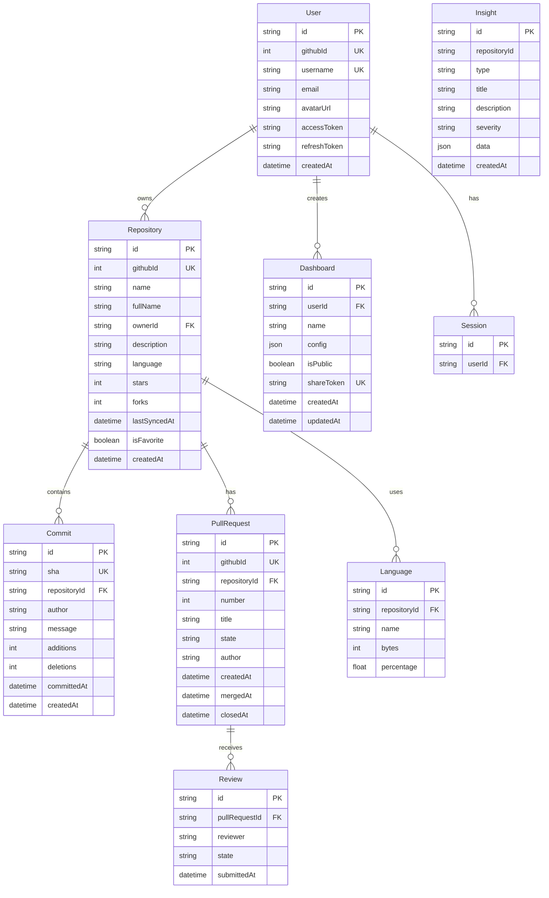

```mermaid
erDiagram
    User ||--o{ Repository : owns
    User ||--o{ Dashboard : creates
    User ||--o{ Session : has

    Repository ||--o{ Commit : contains
    Repository ||--o{ PullRequest : has
    Repository ||--o{ Language : uses

    PullRequest ||--o{ Review : receives

    User {
        string id PK
        int githubId UK
        string username UK
        string email
        string avatarUrl
        string accessToken
        string refreshToken
        datetime createdAt
    }

    Repository {
        string id PK
        int githubId UK
        string name
        string fullName
        string ownerId FK
        string description
        string language
        int stars
        int forks
        datetime lastSyncedAt
        boolean isFavorite
        datetime createdAt
    }

    Commit {
        string id PK
        string sha UK
        string repositoryId FK
        string author
        string message
        int additions
        int deletions
        datetime committedAt
        datetime createdAt
    }

    Language {
        string id PK
        string repositoryId FK
        string name
        int bytes
        float percentage
    }

    PullRequest {
        string id PK
        int githubId UK
        string repositoryId FK
        int number
        string title
        string state
        string author
        datetime createdAt
        datetime mergedAt
        datetime closedAt
    }

    Review {
        string id PK
        string pullRequestId FK
        string reviewer
        string state
        datetime submittedAt
    }

    Dashboard {
        string id PK
        string userId FK
        string name
        json config
        boolean isPublic
        string shareToken UK
        datetime createdAt
        datetime updatedAt
    }

    Session {
        string id PK
        string userId FK
    }

    Insight {
        string id PK
        string repositoryId
        string type
        string title
        string description
        string severity
        json data
        datetime createdAt
    }
```
